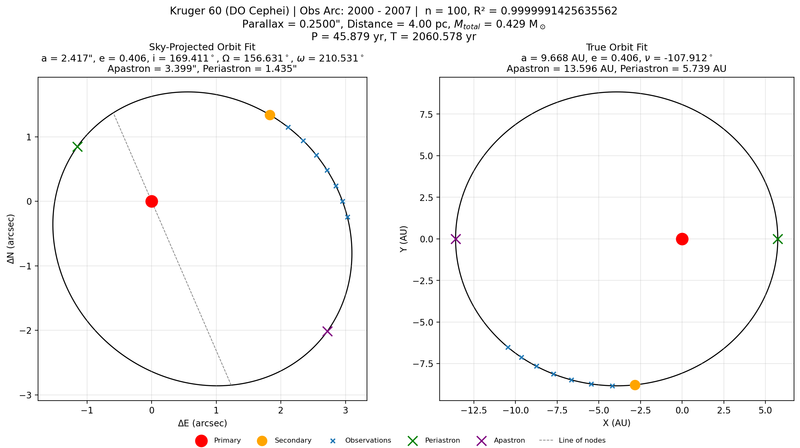
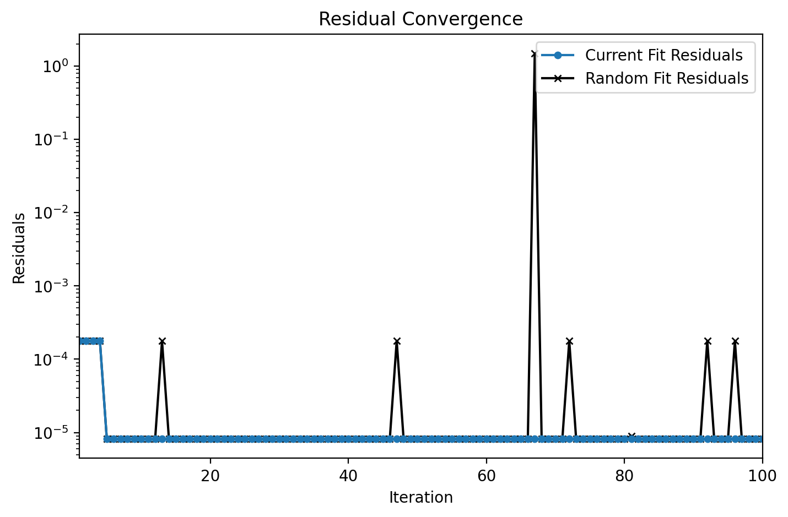

Orbit Fitter for binary stars using the Thiele-Innes Method (7/17/2026)

General Notes:
- Non-linear least squares method using SciPy
- Plotting and analysis done through Matplotlib and NumPy
- Example binary star data from [Stellie Doppie](https://www.stelledoppie.it/) included
    - Kruger 60 (DO Cep)
    - 70 Ophiuchi
    - 61 Cygni
    - Sirius (Alp CMa)
- Assumptions:
    - Both stars are approximately the same distance from Earth
    - Binding energy < 0 (orbit is elliptical)
- Inputs
    - CSV file with
        - Position angle (Theta): Degrees 
        - Angular Distance (RHO): Arcseconds (")
        - Decimal Observation Year
        - Parallax Angle (first data row only): Arcseconds (")
- Calculates
    - Total System Mass
    - Last Periastron Passage Year
    - Distance (parsecs)
    - Orbital Elements
        - Semi-Major Axis (Angular and Physical): a
        - Eccentricity: e
        - Inclination: i
        - Longitude of Ascending Node: $\Omega$
        - Argument of Periastron: $\omega$
        - True Anomaly: $\nu$
- Plots 
    - Sky-Projected and True Orbit
    - Primary Star at origin
    - Secondary Star at last observation date
    - Observation Points
    - Periastron and Apastron
    - Line of Nodes

- Future features
    - Inputting radial velocity and proper motion data to contrain possible orbits
    - Inputting stellar evolution data to contrain total system mass and possible orbits
    - Position Predictions
    - Predicted Position
    - Parabolic/Hyperbolic orbit fitting
    - Past and predicted time of apoapsis and periapsis
    - Roche Lobe location (for interferometic data)
